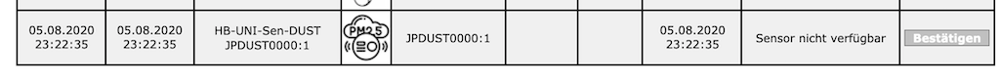

# HB-UNI-Sen-DUST
## Feinstaubsensor (NovaFitness SDS011) für HomeMatic 

## benötigte Hardware
* 1x Arduino Pro Mini **ATmega328P (3.3V / 8MHz)**
* 1x CC1101 Funkmodul **(868 MHz)**
* 1x Taster (beliebig... irgendwas, das beim Draufdrücken schließt :smiley:)
* 1x LED 
* 1x Feinstaubsensor **NovaFitness SDS011**

## Verdrahtung
_TBD_

## CCU
### Status und Bedienung

### Status und Bedienung (bei Sensorfehler)

### Servicemeldung

### Einstellungen

