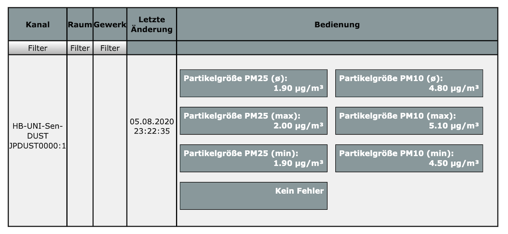

# HB-UNI-Sen-DUST
## Feinstaubsensor (NovaFitness SDS011) für HomeMatic 

## benötigte Hardware
* 1x Arduino Pro Mini **ATmega328P (3.3V / 8MHz)**
* 1x CC1101 Funkmodul **(868 MHz)**
* 1x Taster (beliebig... irgendwas, das beim Draufdrücken schließt :smiley:)
* 1x LED 
* 1x 1k Widerstand
* 1x Feinstaubsensor **NovaFitness SDS011**

## Verdrahtung

## Aufbau
Als Gehäuse verwende ich eine Vorlage von Thingiverse: https://www.thingiverse.com/thing:3498877
Da ich weder eine "Freiluftverdrahtung" noch eine eigene PCB entwerfen wollte, habe ich wie bei vielen Projekten die [HB-UNI-SEN-PCB](https://github.com/alexreinert/PCB#hb-uni-sen-pcb) von Alex genommen.

## CCU
### Status und Bedienung

### Status und Bedienung (bei Sensorfehler)

### Servicemeldung

### Einstellungen

